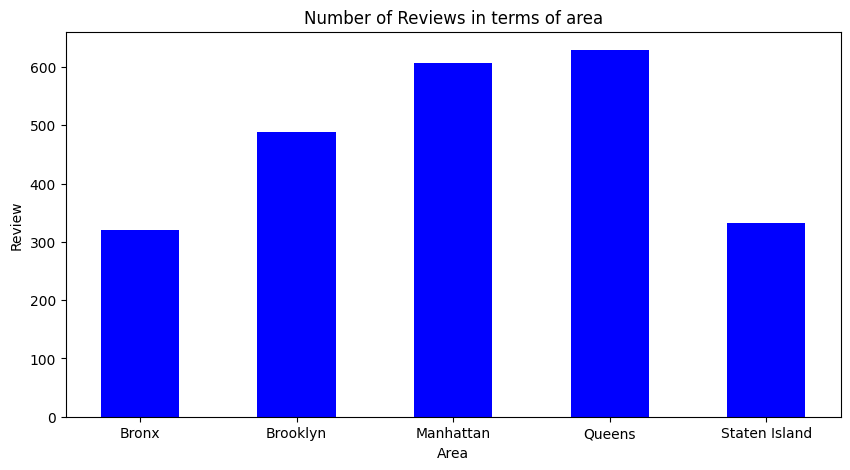
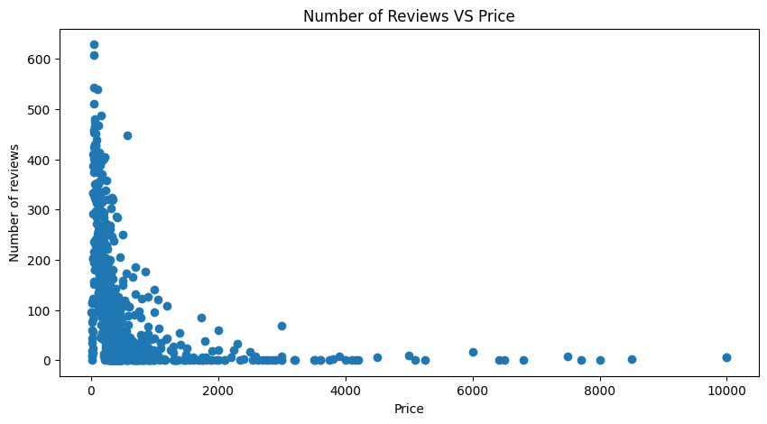
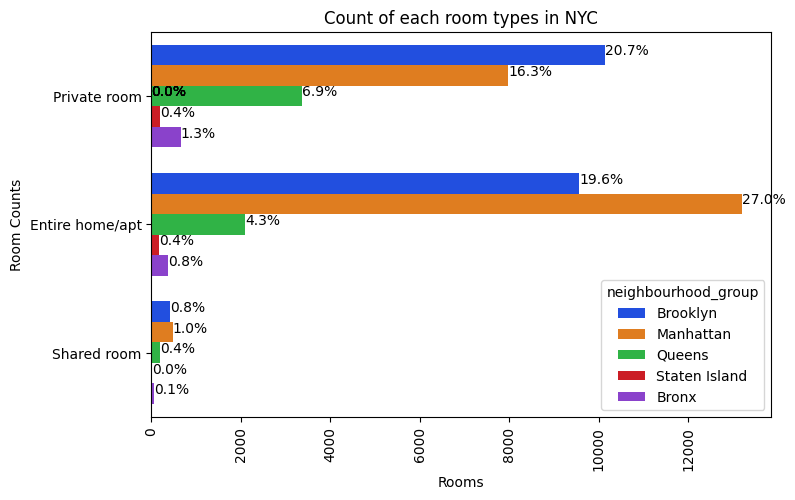
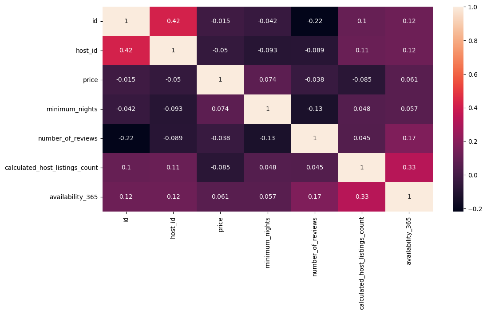

# 🏙️ Airbnb NYC 2019 — Exploratory Data Analysis

<p>
  <a href="https://github.com/sadiq-mansoor/Airbnb-NYC-EDA/actions/workflows/ci.yml"></a>
  <a href="LICENSE"></a>
  
  
  
  
  
</p>

> An end-to-end **exploratory data analysis** of **48,895** New York City Airbnb listings (2019),
> turning raw listing data into clear answers about hosts, neighbourhoods, room types, pricing and demand.
> Completed as my **Data Science internship project at [Coding Samurai](https://codingsamurai.in/)**.

**▶️ [Open the full notebook → `airbnb_nyc_eda.ipynb`](airbnb_nyc_eda.ipynb)** — runs top-to-bottom against the dataset included in this repo.

---

## 🎯 What this project answers

Using pandas group-bys, aggregation and visualisation, the notebook works through eight concrete questions:

1. What can we learn about different **hosts and areas**?
2. How do **room types and prices** vary across boroughs?
3. What do **locations, prices and reviews** tell us together?
4. Which **hosts are the busiest**, and why?
5. Which **hosts charge the highest prices**?
6. Is there a **demand (traffic) difference** between areas?
7. What is the **correlation** between the numeric variables?
8. What is the **room-type mix** across NYC?

## 🗂️ The dataset

The **New York City Airbnb Open Data** (Kaggle, CC0 / public domain) — **48,895 listings × 16 columns**,
compiled from Airbnb.com in August 2019. Included in this repo at [`data/AB_NYC_2019.csv`](data/AB_NYC_2019.csv)
so the notebook runs with **zero setup**.

| Field group | Columns |
|---|---|
| Host | `host_id`, `host_name`, `calculated_host_listings_count` |
| Location | `neighbourhood_group` (borough), `neighbourhood`, `latitude`, `longitude` |
| Listing | `room_type`, `price`, `minimum_nights`, `availability_365` |
| Engagement | `number_of_reviews`, `reviews_per_month`, `last_review` |

## 📊 Selected findings

**Demand by borough** — Manhattan and Brooklyn dominate both listings and reviews.

<p align="center">
  
  
</p>

- **Lower-priced listings attract the most reviews** — engagement concentrates at the affordable end of the market.
- **Manhattan** leads on *Entire home/apt* (~27% of all listings); **Brooklyn** leads on *private rooms* (~20.7%).

**Room-type mix across boroughs**

<p align="center">
  
</p>

**Variable correlation** (Kendall)

<p align="center">
  
</p>

### Headline takeaways
- **Biggest host:** *Sonder (NYC)* holds the most listings, concentrated in Manhattan.
- **Busiest hosts** (by reviews) list *Entire home* / *Private room* types — the formats guests prefer.
- **Price ceiling:** top listings reach **$10,000/night**; demand, however, follows the low-price segment.
- **Supply skews** to *Entire home/apt* in Manhattan and *private rooms* in Brooklyn, Queens and the Bronx.

*(All eight charts and the full commentary are in the notebook.)*

## ▶️ Run it yourself

```bash
git clone https://github.com/sadiq-mansoor/CodingSamurai.git
cd CodingSamurai
pip install -r requirements.txt
jupyter notebook airbnb_nyc_eda.ipynb
```
The dataset ships with the repo, so **Run All** works immediately — no Kaggle download or Google Drive mount required.

## 📁 Repository structure

| Path | Purpose |
|------|---------|
| `airbnb_nyc_eda.ipynb` | The full EDA notebook (portable — no Colab/Drive dependency) |
| `data/AB_NYC_2019.csv` | NYC Airbnb 2019 dataset (48,895 rows) |
| `images/` | Exported charts used in this README |
| `requirements.txt` | Python dependencies |

## 🧰 Skills demonstrated

Data cleaning & missing-value handling · `groupby` aggregation · multi-variable analysis ·
correlation analysis · data storytelling with **matplotlib** & **seaborn** · communicating insights for a non-technical audience.

---
*Data Science internship project by [**Sadiq Mansoor**](https://sadiqmansoor.tech) · [Coding Samurai](https://codingsamurai.in/), 2023.*
